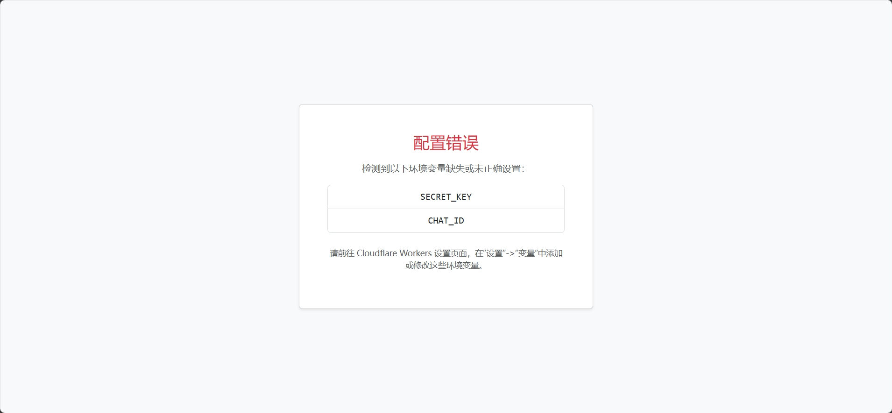
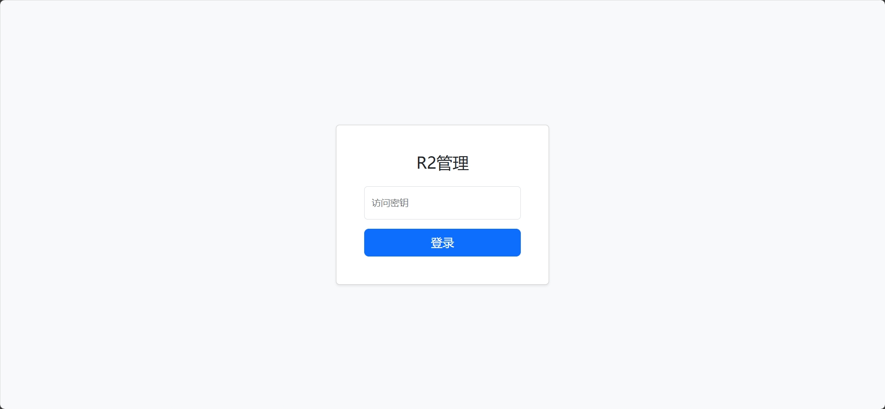
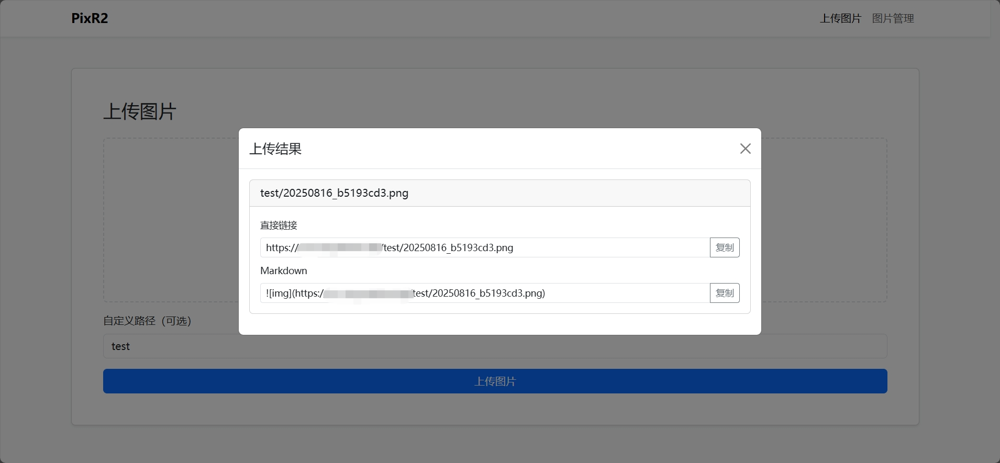
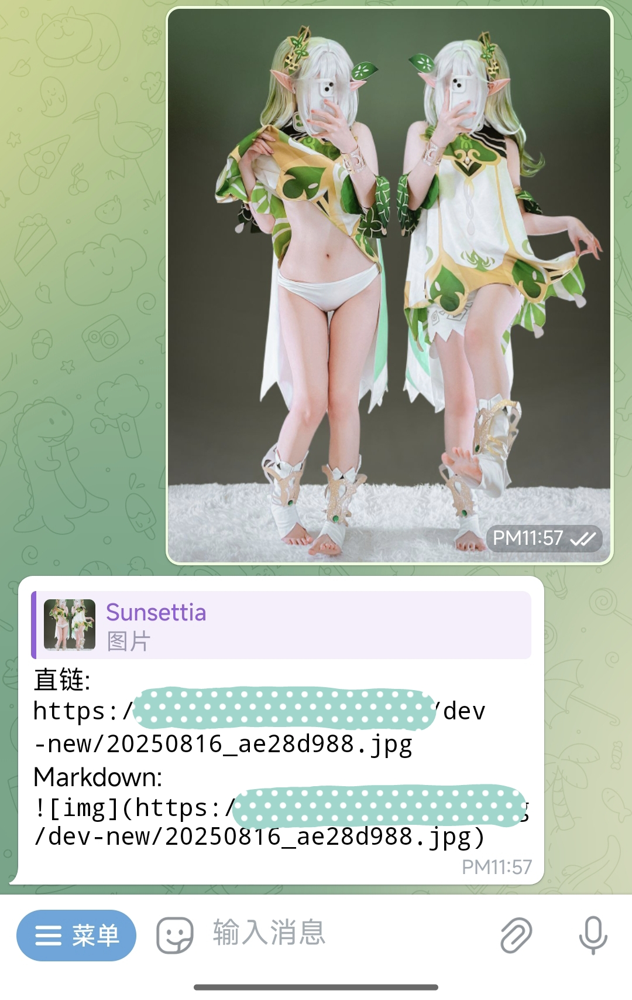
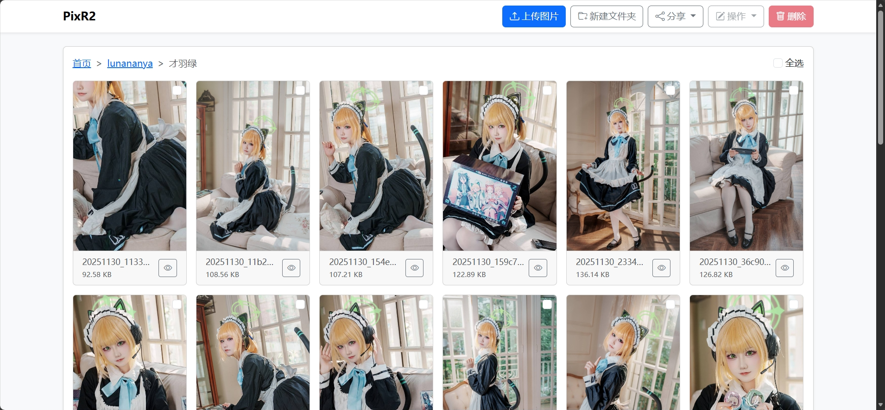
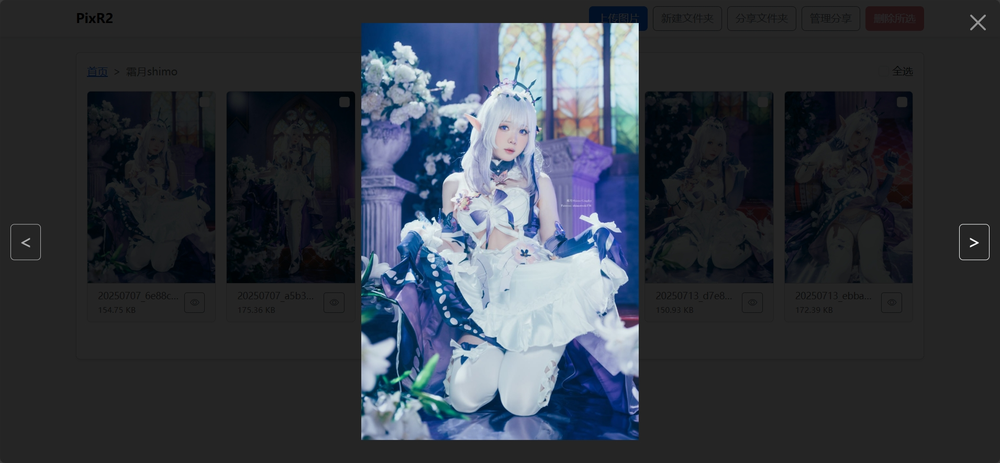
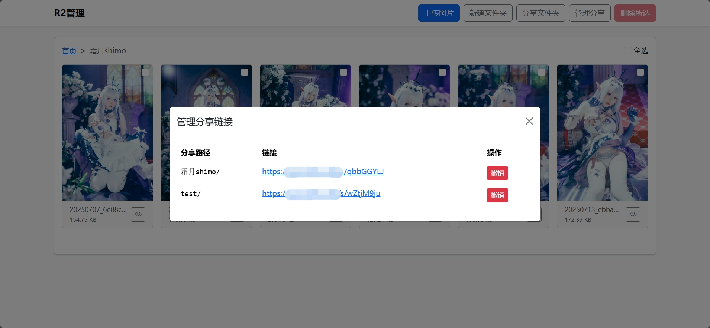

    
    <h1>PixR2</h1>
    
基于 Cloudflare Workers + R2 的多入口图床与图片管理平台

## 项目简介

PixR2 是一个 **无服务器部署（Serverless）** 的在线图床，基于 **Cloudflare Workers** 和 **R2** 构建  
支持 **网页端上传** 与 **Telegram Bot 上传** 两种方式，帮助你快速、安全地将图片存储到云端，并提供管理与分享功能

- 📤 支持上传 **JPG / PNG / GIF / WebP** 图片  
- 🌐 支持网页上传与 Telegram Bot 上传双入口  
- 🖼 支持在线预览与文件管理  
- 🔗 支持创建与管理分享链接，快速将指定文件夹对外分享  
- ⚡ 使用 Cloudflare Workers 部署，无需传统服务器  

## 项目预览

## Worker 部署教程

### 0. 准备工作  
- 你需要准备一个域名，一个 Telegram Bot 以及 ChatID  
- 不知道如何获取可以点击[此处](docs/tutorial/bot.jpeg)查看教程  

### 1. 创建 KV 与 R2 存储桶  
- 在 Cloudflare 侧边栏中找到 **存储与数据库**  
- 创建一个任意名称的 KV 命名空间  
- 在 Cloudflare 侧边栏中找到 **R2 对象存储**  
- 创建一个任意名称的 R2 存储桶  
- 进入刚刚创建的存储桶，点击 **设置** -> **自定义域**，为你的存储桶添加自定义域  

### 2. 上传代码部署  
- 在 Cloudflare 侧边栏找到 **计算（Workers）**  
- 创建一个新的 Worker，选择从 **Hello World!** 模板开始  
- 填写一个喜欢的名字并部署  
- 点击右上角的 **编辑代码**，将 [_worker.js](_worker.js) 文件内容粘贴进去并保存部署  
- 返回 Worker 项目，点击 **绑定** -> **添加绑定**  
  - 选择 **R2 存储桶**，变量名填写 `BUCKET_R2`，选择之前创建的 R2 存储桶  
  - 再次添加绑定，选择 **KV 命名空间**，变量名填写 `SHARES_KV`，选择之前创建的 KV  
  - 再次添加绑定，选择 **KV 命名空间**，变量名填写 `INDEXES_KV`，选择之前创建的 KV  
- 点击 **设置** -> **变量和机密**，添加以下环境变量：

| 变量名           | 说明                              |
|------------------|---------------------------------|
| SECRET_KEY       | Web 面板密码                     |
| TELEGRAM_BOT_TOKEN | Telegram Bot Token              |
| CHAT_ID          | 允许使用机器人的用户 ID，多个用逗号分隔 |
| BASE_URL         | R2 存储桶自定义域                |

- 最后在 **域和路由** 为你的 Worker 项目添加自定义域  
- 访问 `https://<你的自定义域>/setWebhook` 完成 Telegram Webhook 设置  
- 现在可以通过 Telegram Bot 和 Web 面板开始使用了  
- 在 Telegram 里发送任意消息即可获得 Bot 指令帮助  

## 其他

> 本项目受 [cloudflare-r2-telegram-bot](https://github.com/xinycai/cloudflare-r2-telegram-bot) 启发而来

采用 MIT 许可协议，详见 LICENSE 文件
